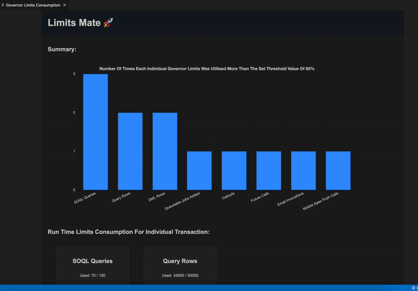
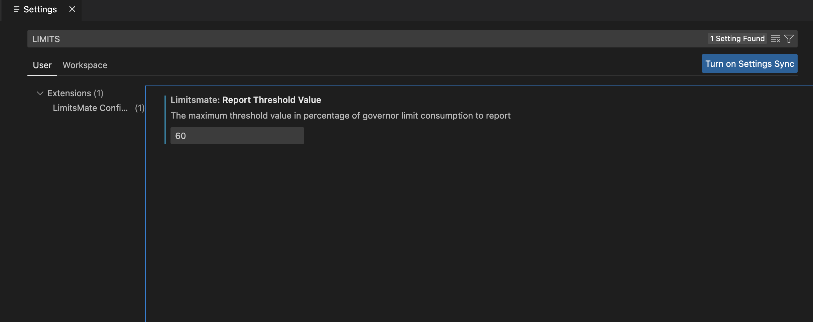

# Limits Mate For Salesforce

The Limits Mate For Salesforce extension provides a comprehensive solution for monitoring and analyzing governor limit consumption during your Salesforce session. With real-time updates and trend analysis capabilities, it offers valuable insights into the usage of governor limits, enabling you to optimize your Salesforce development and deployment workflows for maximum efficiency and performance. 

## Usage

To utilize this extension, it is imperative to first have a valid Salesforce org session established in Visual Studio Code. Once the session is established, the user can "start" the Limits Mate engines and proceed with their intended activity on the connected Salesforce org. 

After the activity is completed, user can initiate computation of governor limits consumption by entering the "show report" command. This will generate a comprehensive report along with corresponding transaction logs to facilitate further analysis.

By default, the Limits Mate session is set to remain active for a duration of 2 hours. Once the session is timed out, the Limits Mate engines are automatically turned off. This is done to ensure that system resources are not continuously consumed, and to prevent unnecessary strain on the system.

If the Limits Mate engines have been automatically turned off due to a session timeout, users can restart them by utilizing the "start" command. 

### Start 🚀

To begin using Limits Mate, it is necessary to start the Limits Mate engines, which will establish an active session with Salesforce. 
This can be done by executing the command `Limits Mate: Start Engine`

### Show Report ✨

This is the second step. Once you are done with your activities on Salesforce, you can enter the `Limits Mate: Show Report` command to generate a consumption report.

### Stop 😴
This step is optional and allows you to free up system resources by closing an active Limits Mate session with Salesforce. To do so, you may enter the following command: `Limits Mate: Stop Engine`

### Clear Logs 🧹
This extension also provides the option to delete the log files created by Limits Mate Engines, which are stored locally on the user's device, in order to free up storage space. This can be accomplished by executing the command `Limits Mate: Delete Logs`

> YouTube Video Link: [How To Use Limits Mate](https://youtu.be/hxlvTyKyNcc)

## Requirements

To utilize this extension, it is mandatory to have Salesforce CLI version 1.77.1 or above installed. 

> Salesforce doc to install Sf executables: 
https://developer.salesforce.com/docs/atlas.en-us.sfdx_setup.meta/sfdx_setup/sfdx_setup_install_cli.htm#sfdx_setup_install_cli_npm

## Extension Settings

By default, Limits Mate displays a Governor Limits Consumption report when the threshold value exceeds 60%. However, you can modify this setting according to your preference by accessing the VSCode settings.

## Release Notes

### 1.0.0

Initial release of Limits Mate supporting default namespace and run time limits
